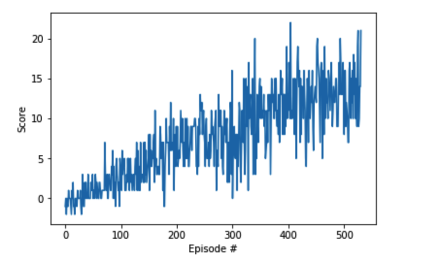

# DRLND Project 1
## Introduction
Deep Reinforcement Learning solution to Unity Banana environment. For this project, we will train an agent to navigate (and collect bananas!) in a large, square world.

A reward of +1 is provided for collecting a yellow banana, and a reward of -1 is provided for collecting a blue banana. Thus, the goal of the agent is to collect as many yellow bananas as possible while avoiding blue bananas.

The state space has 37 dimensions and contains the agent's velocity, along with ray-based perception of objects around agent's forward direction. Given this information, the agent has to learn how to best select actions. Four discrete actions are available, corresponding to:

- 0 - move forward.
- 1 - move backward.
- 2 - turn left.
- 3 - turn right.

The task is episodic, and in order to solve the environment,  agent has to get an average score of +13 over 100 consecutive episodes.

## Getting Started

1. Download the environment from one of the links below. You need only select the environment that matches your operating system:

    - Linux: [click here](https://s3-us-west-1.amazonaws.com/udacity-drlnd/P1/Banana/Banana_Linux.zip)
    - Mac OSX: [click here](https://s3-us-west-1.amazonaws.com/udacity-drlnd/P1/Banana/Banana.app.zip)
    - Windows (32-bit): [click here](https://s3-us-west-1.amazonaws.com/udacity-drlnd/P1/Banana/Banana_Windows_x86.zip)
    - Windows (64-bit): [click here](https://s3-us-west-1.amazonaws.com/udacity-drlnd/P1/Banana/Banana_Windows_x86_64.zip)

    (For Windows users) Check out [this link](https://support.microsoft.com/en-us/help/827218/how-to-determine-whether-a-computer-is-running-a-32-bit-version-or-64) if you need help with determining if your computer is running a 32-bit version or 64-bit version of the Windows operating system.

    (For AWS) If you'd like to train the agent on AWS (and have not [enabled a virtual screen](https://github.com/Unity-Technologies/ml-agents/blob/master/docs/Training-on-Amazon-Web-Service.md)), then please use [this link](https://s3-us-west-1.amazonaws.com/udacity-drlnd/P1/Banana/Banana_Linux_NoVis.zip) to obtain the environment.
2.  Place the file in this folder, unzip (or decompress) the file and then write the correct path in the argument for creating the environment under the notebook Navigation_solution.ipynb:

        env = UnityEnvironment(file_name="Banana.app)

## Description

- dqn_agent.py: Source code for agent
- model.py:  Source code for Q-Network; this is the function approximator
- checkpoint.pth: Model weights learned by the agent during training
- Navigation.ipynb: Jupyter notebook containing the solution code.

## Instructions
1. Open the Jupyter notebook Navigation.ipynb in Jupyter environment.
2. Follow the instructions contained in the notebook. A cell can be executed by placinga cursor inside it and pressing shift+enter.

### Further Implementation

It is intended to implement following enhancements to the original DQN algorithm :

- Double DQN[[Paper](https://arxiv.org/abs/1509.06461)]
- Prioritized Experience Replay [[Paper](https://arxiv.org/abs/1511.05952)]
- Duelling DQN[[Paper](https://arxiv.org/abs/1511.06581)]

### Results

Plot showing the score per episode over all the episodes :

