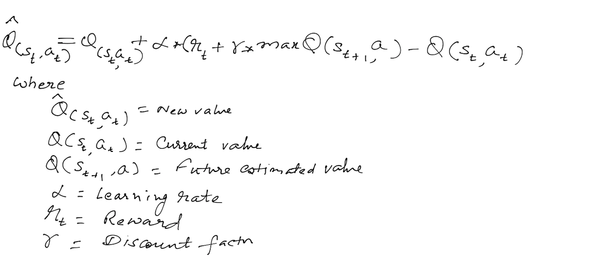
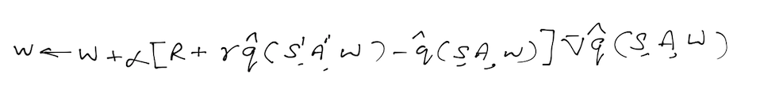

# Project 1 : Navigation

### Author : Vimal Kansal

The aim of this project is to demonstrate the ability of one class of Reinforcement Learning methods, namely, "Value based methods" to learn a suitable policy to solve a given environment. More specifically, we intent to show the capabilities of an algorithm called "[Deep Q Learning](https://storage.googleapis.com/deepmind-media/dqn/DQNNaturePaper.pdf) to solve a Unity environment where the agent gets to learn to gather Yellow bananas and avoid blue bananas. This is basically a model free environment. The environment state space is a continous space consisting of 37 dimensions. Agent gets a reward of +1 on picking a yellow banana and a reward of -1, if it picks up a blue banana. Agent has 4 actions at its disposal : move left, move right, move forward and move backward. 

Report is organised in in sections :

- **Implementation**
- **Results**
- **Ideas for further development**

## **Implementation**

This implementation uses [Deep Q Learning](https://storage.googleapis.com/deepmind-media/dqn/DQNNaturePaper.pdf) algorithm as a function approximator for handling the continous state space. Google engineers were able to achieve super human performance for an agent to learn and play Atari games using this algorithm. This is an off policy learning algorithm where policy being evaluated is different from policy being learnt. 

For a discrete environment state space, we have a table based algorithm (Temporal Difference) called Q learning to learn action-value function Q(s,a) where  s is the current state and a being the action being evaluated. This being a Temporal Difference method, it differs from Monte Carlo methods in the sense that instead of waiting for the episode to end before learning can happen, we can learn from each time step. More specifically, once an action is taken and next state is arrived at, we use the current Q-value of that state as the estimate of future rewards.

One major issue with this approach for the "Banana gathering" environment is that it has a continous environment space and our table based Q learning algorithm can not be used to solve this environment. What we need is a **function approximator**. To use a function approximator, we introduce a new parameter "theta" that helps us to obtain an approximation of Q(s,a) as Qhat(s,a,theta). This turns the problem into a supervised learning problem where Qhat represents the estimated value and R + gamma * max Q(sdash,a) becomes the target value. As in a superwised learning algorithm we use a mean-square error as the objective function and update the weights using gradient descent. For function approximator we use deep neural network as this allows us to learn non linear surfaces. In our implementation, we use a 2-hidden layer network with both layers having 64 nodes and with **relu** activation applied after each fully connected layer. Adam optimiser was used for optimisation step. 

One problem with the algorithm as described above is that it is highly unstable. Tqo techniques learnt during the course, were applied to stabalise the algorithm :

- Fixed Q Targets : It is evident from the eqn that the target during training itself is dependent on w which is getting updated which means target itself is moving during training. To work around this problem, we fix the weight parameter w in calculating Qhat(s,a,w). To achieve this, we implement 2 separate neural networks - one being the online network used for learning w and other is the target network. The weights which we use for target network are taken from online network by freezing the model parameters for few iterations and updating it periodically after few time steps. This way we ensure that the target network parameters are quite different from online network parameters.

- Experience Replay : This is the other important technique used for stabilizing training. If we keep learning from experiences as they come, then we have  basically observed a sequence of observations each of which are linked to each other. This destroys the assumption of the samples being independent. In ER, we maintain a Replay Buffer of fixed size (say N). We run a few episodes and store each of the experiences in the buffer. After a fixed number of iterations, we sample a few experiences from this replay buffer and use that to calculate the loss and eventually update the parameters. Sampling randomly this way breaks the sequential nature of experiences and stabilizes learning. It also helps us use an experience more than once.

In the project, both of the above techniques have been implemented and PyTorch has been used as the framework. 

### **Hyperparameters**

| Hyperparameter                      | Value                |
|-------------------------------------|----------------------|
| Replay buffer size                  | 1e5                  |
| Batch size                          | 64                   |
| Gamma (discount factor              | 0.99                 |
| Tau                                 | 1e-03                |
| Learning rate                       | 5e-04                |
| Update Interval                     | 4                    |
| Number of episodes                  | 3000 (Solved in 431) |
| Max number of timesteps per episode | 2000                 |
| Epsilon start                       | 1.0                  |
| Epsilon minimum                     | 0.1                  |
| Epsilon decay                       | 0.995                |

## **Results**

The environment was solved in 431 episodes. The plot of the rewards is shown below :

# **Ideas for improvement**
- Implementing Double DQN : [paper](https://arxiv.org/abs/1509.06461)
- Duelling Network : [paper](https://github.com/dalmia/udacity-deep-reinforcement-learning/blob/master/2%20-%20Value-based%20methods/Project-Navigation)
- Using priortized history replay ([paper](https://arxiv.org/abs/1511.05952))